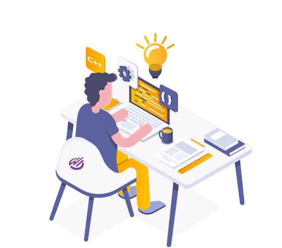

<h1 align="center">Hello World! 👋 I'm Ryan Tusi</h1>

<h5>👨‍💻 Hello there! I'm a software engineering enthusiast on a journey to merge innovation with creativity. As a versatile student developer, I'm driven by a passion for crafting remarkable digital experiences and diving into the realms of Artificial Intelligence and Machine Learning 🚀.</h5>

<h5>🎨 Beyond coding, I thrive in design realms, sculpting graphics that breathe life into ideas. As a team leader, I orchestrate harmony among diverse talents, channeling collaborative spirits towards successful project horizons.</h5>

<h5>🌟 Mentoring is my forte; I relish guiding aspiring minds, nurturing their potential in both academia and industry. Balancing project management finesse with event organizing prowess, I've orchestrated seamless spectacles while juggling multiple hats 🎩.</h5>

<h5>📚 Constant learning is my compass; I'm continually honing skills, eager to contribute my multifaceted expertise to the ever-evolving landscape of software engineering. Join me on this journey of innovation, collaboration, and relentless growth!</h5> 

 

<h2 align="left">Some Facts About Me</h2>

- 🔭 I’m currently working on **Natural Language Processing**

- 🌱 I’m currently learning **AI and ML**

- 📫 How to reach me *[https://www.linkedin.com/in/ryantusi/](https://www.linkedin.com/in/ryantusi/)*

- 👨‍💻 All of my projects are available at *[https://github.com/ryantusi/](https://github.com/ryantusi/)*

- 📄 Know about my experiences *[https://shorturl.at/bk359](https://shorturl.at/bk359)*

- ⚡ Fun fact: **I'm a Fitness Trainer and Boxer too**

<h2 align="left">Skillset</h2>

<h3 align="left">Programming Languages:</h3>

<h3 align="left">Frontend Development:</h3>

<h3 align="left">Backend Development:</h3>

<h3 align="left">AI / ML:</h3>

<h3 align="left">Database Management:</h3>

<h3 align="left">Data Visualization:</h3>

<h3 align="left">Devops:</h3>

<h3 align="left">Backend as a Service (BaaS):</h3>

<h3 align="left">Frameworks:</h3>

<h3 align="left">Testing:</h3>

<h3 align="left">Softwares:</h3>

<h3 align="left">Others:</h3>

 
 

<h2 align="left">Connect with Me</h2>

  
  
